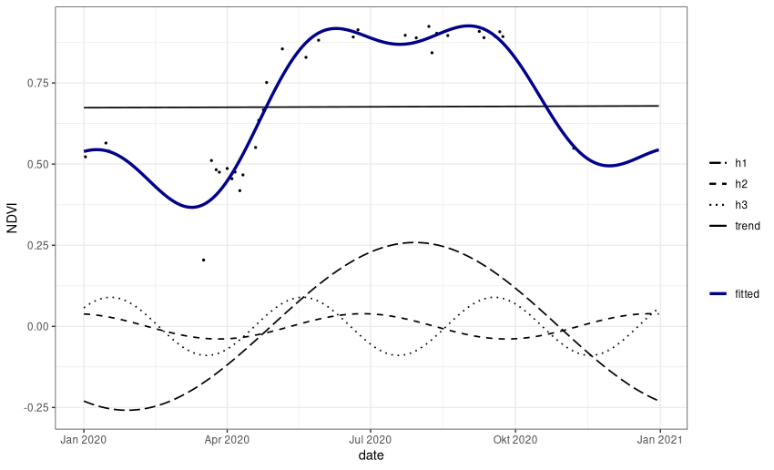

# rHarmonics demo

R package for harmonic modelling of time-series data.

To calculate the harmonic fitted curve of a periodic signal, ordinary least squares regressions are computed using coupled sine and cosine curves on time-series data. The underlying algorithm which is based Shumway, R. H., & Stoffer, D. S. (2017) equations 4.1 - 4.2 can be seen below:


Coupled sine and cosine waves of a certain frequency are called harmonic. A harmonic is characterised by its amplitude and phase. The number of the harmonic indicates the number of cycles completed by the wave over the year. 

Together with a trend component, the sum of all harmonics produces the fitted curve.

Every component contains a proportion of the explained variance of the original values. Most variation is contained in the trend component and the first two harmonics, presenting biannual and triannual vegetation development.


## Installation

To install the current forked version, use `devtools`.

```R
devtools::install_github("Wagner-L/rHarmonics")
```

## Available Functions

The following functions are currently available and tested on Manjaro Linux.

* `harmonics_fun()` This function enables the user to model different number of cycles per year for a given time series data set (original function from MBalthasar/rHarmonics).

* `harmonics_fun_eq()` This function is based on harmonics_fun() and additionally enables to calculate artificial, equidistant time steps. Furthermore explained variance can be printed.

## Example

In this example a fitted curve using three harmonics is computed based on a Sentinel 2 NDVI time series data:

```R

# Load sample NDVI time-series data.frame
ndvi_df <- base::readRDS(system.file(package = "rHarmonics",
                                     "extdata", "S2_ndvi_harz.rds"))

# create a daily date sequence of 2020 to use as desired new dates for modelling
new_dates =  seq(as.Date("2020/01/01"), by = "day", length.out = 366)
new_dates

# Apply harmonic function using 3 harmonics
# fitted values, trendand allharmonics are returned
# overall explained varianceand of each harmonic is printed

fitted_ts <- rHarmonics::harmonics_fun_eq(user_vals=ndvi_df$values,
                                user_dates = ndvi_df$dates,
                                harmonic_deg=3,
                                new_dates=new_dates,
                                return_vals="all",
                                print_variance = T)

# Combine fitted values with original df
df_fitted <- data.frame(new_dates, fitted_ts[1], fitted_ts[2], fitted_ts[3], fitted_ts[4], fitted_ts[5])
colnames(df_fitted) = c("new_dates", "fitted", "trend", "h1", "h2", "h3")       

# Plot original data with fitted values
library(ggplot2)

colors <- c("fitted" = "darkblue")
linetypes <- c("trend"= "solid", "h1"="longdash", "h2"= "dashed", "h3" = "dotted")

ggplot(data=df_fitted, aes(x=new_dates)) +
  geom_point(data=ndvi_df, mapping = aes(x = dates, y = values), size=0.5)+
  geom_line(aes(y = df_fitted[,3], linetype="trend"), size=0.6) +
  geom_line(aes(y = df_fitted[,2], color="fitted"),size=1.2) +
  geom_line(aes(y = df_fitted[,4], linetype="h1"), size=0.6)  +
  geom_line(aes(y = df_fitted[,5], linetype="h2"), size=0.6)  +
  geom_line(aes(y = df_fitted[,6], linetype="h3"), size=0.6)  +
  theme(legend.position="bottom",
        legend.text = element_text(size=9),
        axis.text = element_text(size=9),
        axis.title = element_text(size=9),
        plot.title=element_text(size = 9),
        legend.title=element_text(size=9))+
  theme_bw() +
  labs(x="date",
       y="NDVI",
       color = " ",
       linetype = " ")+
  scale_color_manual(values = colors)+
  scale_linetype_manual(values = linetypes)
```
Result for modelling with 3 harmonics:


For comparison - Result for modelling with 4 harmonics:


The function can also be applied on a multi-layer raster stack to create a cloud-interpolated psuedo times-series data set:

The ratser package's calc() function is used to apply harmonic 
modelling on the vector of each pixel in the raster. As it can 
only return one layer per time step, only fitted values are 
returned (which is set as default). Also no variances should be printed.

```R
library(raster)

# Load sample cloud masked Sentinel-2 time series raster brick
raster_ndvi_harz <- raster::brick(system.file(package = "rHarmonics",
                                              "extdata",
                                              "S2_ndvi_harz.tif"))

fitted_raster <- raster::calc(raster_ndvi_harz,
                              function(x){
                                rHarmonics::harmonics_fun_eq(user_vals=x,
                                                                user_dates = ndvi_df$dates,
                                                                harmonic_deg = 3,
                                                                new_dates=new_dates)
                              })
```
Animation of daily NDVI values with time series graph of three selected pixels:


The modelled curve allows a clear distinction between deciduous and coniferous forests.


## Citation
Philipp, M. B. (2020): rHarmonics V.1.0. Zenodo. https://doi.org/10.5281/zenodo.3994381.

## Literature
Shumway, R. H., & Stoffer, D. S. (2017). Time series analysis and its applications: with r examples. Springer.
